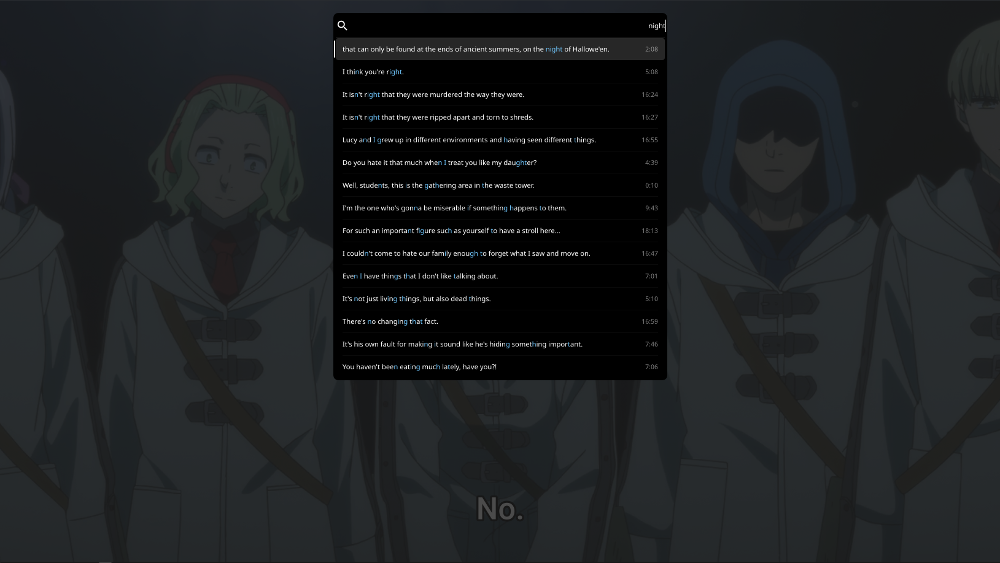

# mpv-sub-search
Lua script for mpv. Allows to search subtitles with uosc interface.




## Requirements
- `uosc`
- `ffmpeg`

## Installation
Place `sub-search.lua` in your mpv `scripts` folder.

## Keybindings
No keys are bound by default. Add these to your `input.conf`:
```
<key> script-binding sub-search-open
```
## Usage
Press the bound key — a uosc palette opens with all subtitle lines.
Type words to filter. Click or press Enter on a result to jump to that moment.
